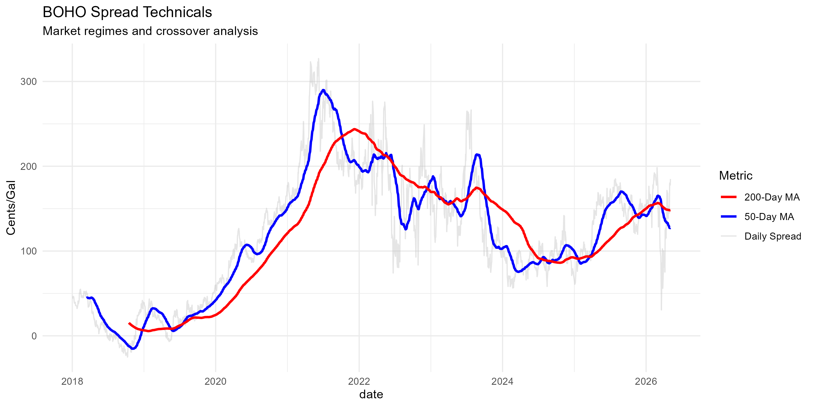
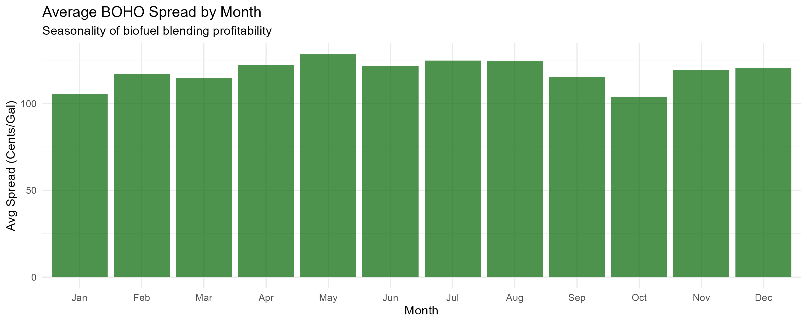

# Biofuel Market Intelligence: BOHO Spread Analysis

### **Overview**
This project provides a quantitative evaluation of the **BOHO Spread** (Bean Oil vs. Heating Oil), a fundamental indicator used to assess the economic viability of biodiesel blending. By analyzing the price delta between soybean oil and heating oil, this model identifies shifts in demand regimes and strategic risk-management opportunities for the biofuels and vegetable oil sectors.

### **Market Logic**
The BOHO spread serves as a primary "governor" for agricultural oil consumption within the energy complex. 
*   **Narrowing Spread:** Signals increased blending profitability, typically driving higher demand for soybean oil "crush."
*   **Widening Spread:** Suggests potential headwinds for bio-based fuel competitiveness against traditional petroleum products.

### **Key Visualizations**
#### **1. Market Regimes & Technical Volatility**
This analysis employs 50-day and 200-day Simple Moving Averages (SMA) to filter market noise and identify long-term trends in blending profitability.

#### **2. Seasonal Demand Patterns**
Historical data identifies recurring seasonal shifts in the spread, allowing for predictive insights into supply/demand dynamics during the U.S. driving and heating seasons.

### **Repository Structure**
The project follows a modular structure to separate raw data processing from professional reporting:

*   **/data**: Landing directory for cached datasets. (Note: The current workflow pulls live market data via API to ensure real-time accuracy).
*   **/scripts**: 
    *   `01_BOHO_analysis.R`: The core R script for data ingestion (via `tidyquant`), unit normalization, and technical modeling.
*   **/output**:
    *   `boho_technicals.png`: High-resolution export of technical regime analysis.
    *   `boho_seasonality.png`: High-resolution export of seasonal trend analysis.
*   **report.html**: A decision-ready, professional market intelligence report synthesized for business and policy stakeholders.

### **Technical Implementation**
*   **Normalization:** Prices are converted from disparate units (cents/lb vs. USD/gal) to a standardized cents-per-gallon equivalent based on industry-standard conversion factors (~7.5 lbs of oil per gallon of biodiesel).
*   **Modeling:** Developed in R using the `tidyverse` for data wrangling, `TTR` for technical indicators, and `patchwork` for professional-grade visual layouts.

---
*This project is part of a professional portfolio demonstrating competence in commodity supply/demand modeling and quantitative research for World Perspectives, Inc.*# BOHO-Analysis
# BOHO-Analysis
